# Decision map

Legend: **✓ agreed/locked** · **❓ open (your call)** · lettered ❓ = the live decisions.

```mermaid
flowchart TD
    F["FOUNDATION ✓
    music = frequency representation of the scene
    meaning is listener-emergent · minimize AI (every number measured)
    spine: SOURCE → TABULATION → MUSIC"]
    F --> S

    subgraph S["1 · SOURCE"]
      S1["✓ synthetic scene — Blender (built & verified)"]
      S2["✓ engine emits geometry: fovea = camera · r = depth buffer"]
      S3["✓ photoreal PBR → dense brightness histogram"]
      S4["later: image · video (SfM) · text"]
    end
    S --> FID

    subgraph FID["2 · FEATURE ID — the one perceptual step"]
      A1["✓ author only WHICH regions exist (boxes)"]
      A2["✓ sub-features must CONNECT to parent: contiguous freq · shared gate · loudness = share"]
      A3["❓ D — children via: auto scale-decomposition  vs  explicit nested boxes"]
    end
    FID --> M

    subgraph M["3 · MEASURE → TABULATION (per feature) — per-pixel color→spectrum"]
      M1["✓ C — which frequencies (support) ← per-pixel color, H+S"]
      M1b["H → pitch (red↔low, violet↔high; purples = red+blue, two peaks) · S → tone↔noise / purity"]
      M5["✓ C — gain at each freq ← brightness V, accumulated (reframes B: V = weight, not pitch)"]
      M5b["per-pixel spectrum = V·[ S·tone(hue) + (1−S)·flat ];  assembly = brightness-weighted histogram of color-freqs"]
      M2["✓ C — [f_lo, f_hi] = robust (percentile, sat-weighted) extent of the support"]
      M6["note: color drives register → size→pitch (option A) superseded  ❓ confirm retire"]
      M3["window narrows ← foveal distance  ✓ acuity multiplier"]
      M4["✓ A — center-of-vision = center of every frame (first-person sims)"]
      M7["whole-feature loudness ← energy share × 1/√r  ✓ · visibility ← gate 0→1  ✓"]
      M9["✓ E — TIME / spectrogram = run [C] per frame of the moving sim (frame seq = time); PDE only for no-motion stills"]
    end
    M --> MU

    subgraph MU["4 · SYNTH → MUSIC"]
      U1["✓ pure additive — the feature IS the sound"]
      U2["✓ grain fusion cap ~25 / s"]
      U3["SAFETY (final stage) ✓ built — 30 Hz HPF (excludes eyeball/body resonance) · −1 dBFS peak limit · NaN/click scrub"]
      U4["✓ F — mechanical done; LUFS / true-peak / resonance-notch = future polish"]
    end
    MU --> P["PARKED — reconcile w/ old Storyboard DAG · CI verify · API layer"]
```

## Decisions

Resolved 2026-06-18:
- ~~**A — center-of-vision**~~ ✓ = the **center of every frame** — we only build first-person sims (Steve's view in Minecraft), so the gaze is always screen-center.
- ~~**F — safety**~~ ✓ = mechanical stage built (30 Hz HPF, −1 dBFS limit, NaN/click scrub, wired into `save_wav`); LUFS / true-peak / resonance-notch noted as future polish.
- ~~**C — what sets the spectrum + `[f_lo, f_hi]`**~~ ✓ = **per-pixel color→spectrum**. Each pixel = a tiny light-spectrum → several frequency bins. **H+S → which frequencies** (Hue → pitch red↔low; Saturation → tone↔noise purity), **V → gain** (per-pixel spectrum `V·[S·tone(hue)+(1−S)·flat]`, assembled as a brightness-weighted histogram of color-frequencies). `[f_lo,f_hi]` = robust percentile extent. This **reframes B** (brightness = gain, not pitch) and **supersedes size→pitch / option A** (color now sets register — ❓ small confirm to retire A).

- ~~**E — time / spectrogram source**~~ ✓ = **run [C] per frame of the moving sim** — the frame sequence is the time axis; flicker/approach/occlusion fall out measured. PDE only for the no-motion (lone still / text) fallback. Composition lives in the camera path. Built: `walk_scene.py` + `synthesize_spectrogram` → `demos/walk/`.

Still open (the live ones):
- **D — Sub-feature children.** automatic scale-decomposition (default) vs explicit nested boxes (escape hatch for same-scale/different-material).
- **Small:** confirm retiring size→pitch (option A); wire the engine object-index pass so features can be segmented/tracked across frames (walk currently uses whole-frame pixels).
- **World design.** music richness = world richness — bias palettes for hue variety, route the path through contrasting color zones.
